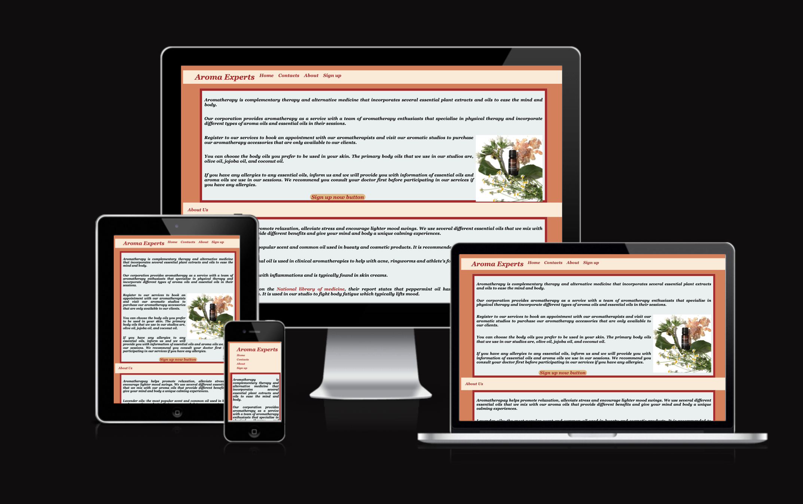
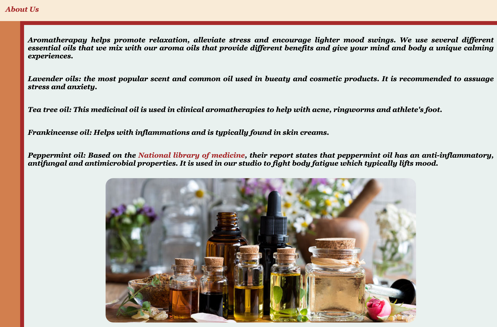
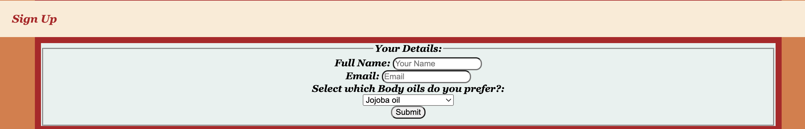
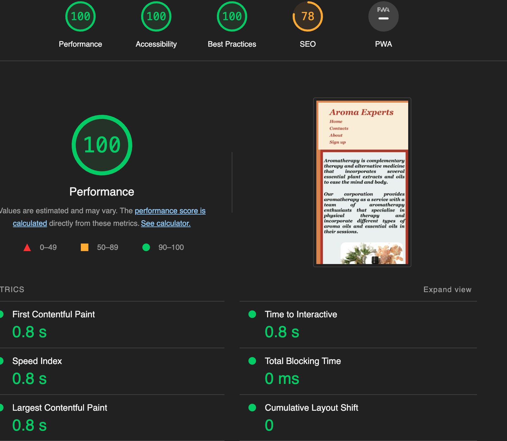

## Aroma Experts 
Welcome to my Website AromaExperts!
On the about webpage, it explains the different products used during the customer's session with the aromatherapist.
They are also encouraged to pick and choose which oils they would prefer to use.

### Navigation Bar

The Navigation bar is featured on each page (home, contacts, about, and sign up). The navigation allows users to move across the single page site with ease. The navigation bar is fixed to the top of the page to improve usability.

### Footer Section

The footer section contains links to facebook and twitter. This allows users to follow the page on the respective social sites.

### Home Section

The home page provides a few pointers on what our service is about and what it provides for clients and a sign up button at the bottom of the page that navigates them to the sign up page. The homepage has a very simplistic layout with an example image at the right handisde of the page of what products would be presented to the clients as part of the service.

### About Section

This section introduces the customer, the different products we would be using for the session. It also introdusces knowledge of our products.

### Sign Up Section

Potential customers can submit their information to enquire about services of the site. The customer can submit their

- Name
- Email

The registration form includes a submit button to send their information to us. 

### Contacts Section

Our contacts show the means of the communication for the customer to get in touch. The information includes the company address and number

## Testing 

### Validator Testing 

- HTML
  - No errors were returned when passing through the official [W3C validator](https://validator.w3.org/nu/)
- CSS
  - No errors were found when passing through the official [(Jigsaw) validator](https://jigsaw.w3.org/css-validator/validator)
- Screen compatibility 
    - I have checked that the screen compatibility using the website, 'AM I RESPONSIVE?' [website](https://ui.dev/amiresponsive)
- Performance
    - The site performace was tested on lighthouse.
    

## Deployment procedure

The application is deployed by configuring the github repository to use the main branch for a github pages site. Each commit to the main branch will update the site url.

## Credits

credits:
I have used multiple images from google images that were referencing articles, mainly from:
- Aromatherapy associates.
- Aromaweb

